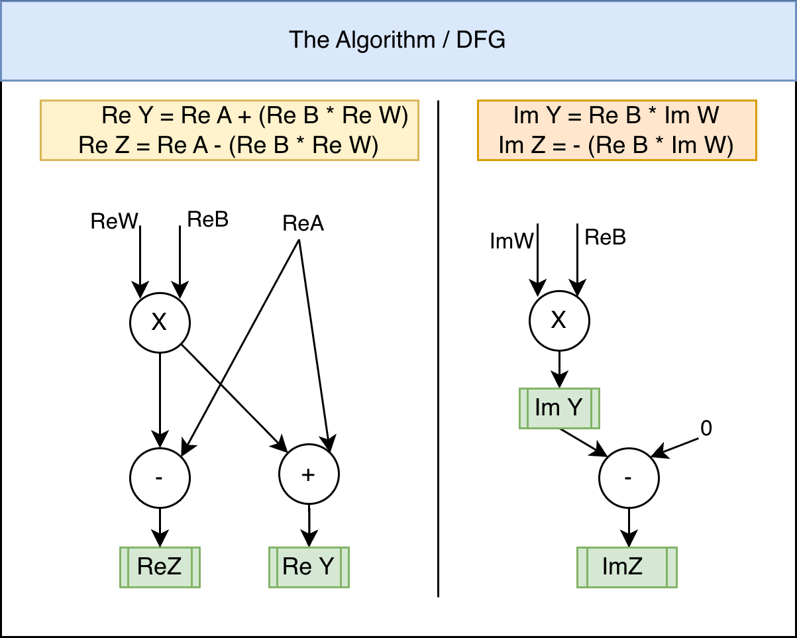
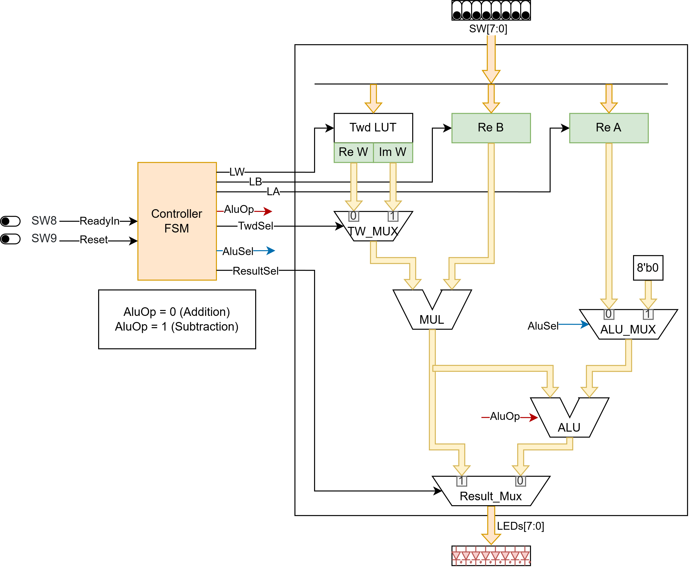
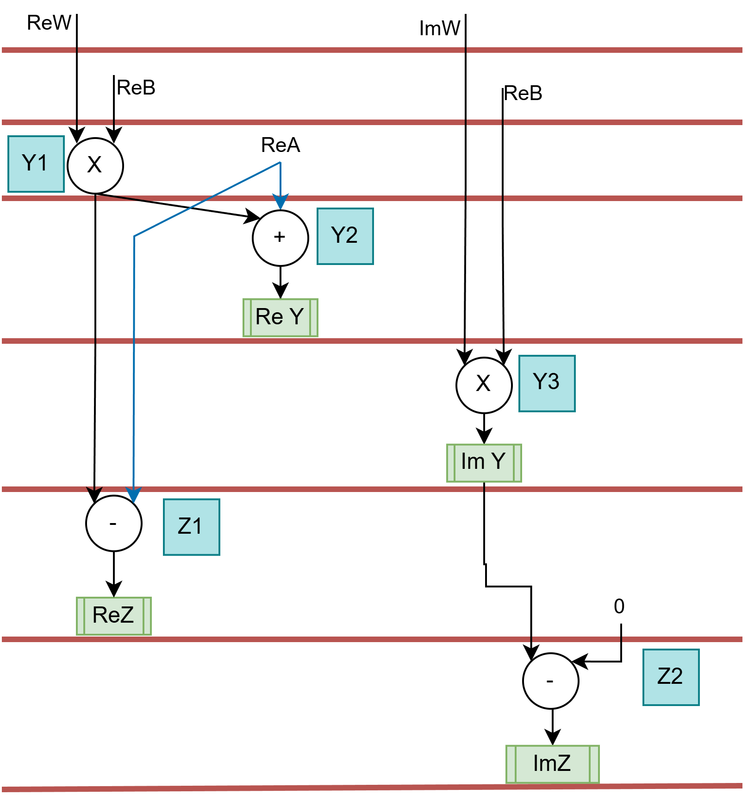
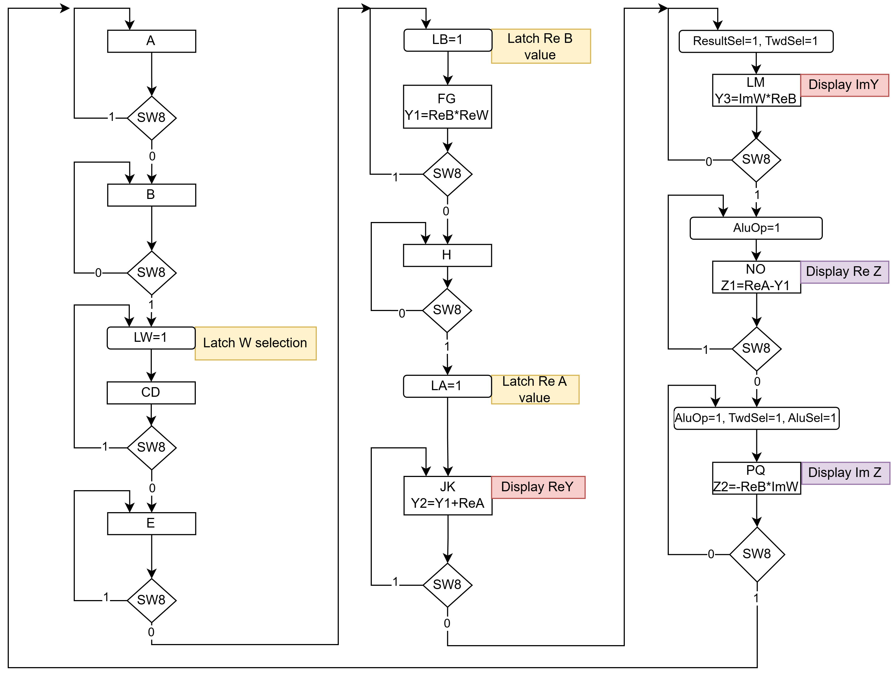

# FFT Butterfly Unit

A manually synthesised FFT butterfly unit in SystemVerilog, targeting Intel FPGA (Cyclone series). Developed following high-level synthesis methodology as a university coursework project.

The design takes two 8-bit signed integer inputs and a twiddle factor index via physical switches on an FPGA board, computes the complex butterfly outputs Y and Z, and displays each component sequentially on LEDs. The user sets data on SW[7:0], toggles SW[8] as a handshake signal to step through the input/output sequence, and reads results from LED[7:0]. SW[9] acts as an active-low master reset. Since the imaginary parts of both inputs are assumed to be zero, the full complex multiply simplifies to two real multiplications and two additions/subtractions.

<p align="center">
    
</p>

## The Pseudocode

The handshake protocol that drives the FSM is defined by the following pseudocode from the specification. The state names used in [`controller.sv`](rtl/controller.sv) (A, B, CD, E, ...) map directly to these steps:

```
0. Assert master reset (SW9 = 0)
1. Deassert master reset (SW9 = 1)
2. REPEAT
     a.  Wait for SW8 = 0
     b.  Wait for SW8 = 1
     c.  Read twiddle factor index (0..7) from SW[2:0]
     d.  Wait for SW8 = 0
     e.  Wait for SW8 = 1
     f.  Read Re(B) from SW[7:0]
     g.  Wait for SW8 = 0
     h.  Wait for SW8 = 1
     i.  Read Re(A) from SW[7:0]
     j.  Display Re(Y) on LEDs
     k.  Wait for SW8 = 0
     l.  Display Im(Y) on LEDs
     m.  Wait for SW8 = 1
     n.  Display Re(Z) on LEDs
     o.  Wait for SW8 = 0
     p.  Display Im(Z) on LEDs
     q.  Wait for SW8 = 1
3. UNTIL forever
```

## The Challenge

The objective was a manual high-level synthesis of an FFT butterfly, replicating the steps that HLS tools automate: deriving a data flow graph (DFG) from the butterfly equations, performing resource-constrained scheduling, binding operations to hardware units, and generating RTL code.

The butterfly computes:

```
Y = A + B * W
Z = A - B * W
```

where A and B are complex input samples and W is a twiddle factor (W8^k for an 8-point FFT). With Im(A) = Im(B) = 0 the equations expand to four real operations across the real and imaginary output components.

The resource constraint was one multiplier and one ALU, minimising area. Scheduling had to fit within the existing handshake states without adding new ones. Twiddle factors are represented in Q1.7 signed fixed-point format, where +1 cannot be represented exactly and is approximated as 0x7F (0.9921875). The 8x8 signed multiplication produces a 16-bit result, and the correct integer portion must be extracted from bits [14:7].

## Architecture



The system is split into a controller FSM and a combinational datapath, connected by latch-enable and mux-select signals.

The design was developed in three stages. First, the pseudocode was translated into a cycle-accurate FSM capturing only the handshake sequencing with no computation. Second, the DFG was derived from the simplified butterfly equations. Third, the DFG operations were scheduled under the one-ALU, one-multiplier constraint and embedded into the existing FSM states.

<p align="center">
    
</p>

Scheduling turned out to have a unique solution. The latest permissible cycle of each computation is fixed by the output display order, while the earliest is fixed by when the inputs become available. Since both boundaries come from the pseudocode FSM, each DFG node had exactly one valid position, and no additional states were needed.



Binding was straightforward given the single instance of each resource type: all additions and subtractions (Y2, Z1, Z2) map to the ALU, and both multiplications (Y1, Y3) map to the multiplier.

## Key Design Decisions

**Purely combinational datapath.** No intermediate or output registers exist beyond the four input registers (Re(W), Im(W), Re(B), Re(A)). Once inputs are latched, the result propagates to the LEDs within the same clock cycle through the multiplier, ALU, and output mux. This eliminates pipeline wait states at the cost of a longer critical path, which limits maximum clock frequency. For an FPGA demo driven by human switch-toggling, this trade-off is well worth the simpler control logic.

**Mealy FSM outputs.** The controller uses Mealy outputs so that latch-enable signals fire on the same clock edge as the state transition. With Moore outputs, the enable would only assert after entering the new state, requiring an extra state for the data to be registered. This keeps the state count minimal and matches the pseudocode step-for-step.

**Recomputing rather than storing.** Im(Z) equals −Im(Y), so it could be derived from a stored copy of Im(Y). Instead, it is recomputed from the input registers by steering the muxes differently. This avoids an additional register and control signal at the cost of redundant combinational logic, which is negligible.

**Q1.7 twiddle encoding.** The twiddle factors use Q1.7 signed fixed-point, where the 8 possible values for an 8-point FFT are stored in a 16-entry LUT (8 bits Re, 8 bits Im per entry). The value +1 is approximated as 0x7F (0.9921875), introducing a small rounding error that is acceptable for 8-bit data.

**Clock divider for FPGA debouncing.** Rather than adding dedicated debounce logic per switch, the 50 MHz board clock is divided by 2^15 (~1525 Hz) using a simple counter module. This was sufficient to eliminate switch bounce at the cost of reduced maximum throughput, which is irrelevant for manual operation.

## Verification

A C reference model ([`reference_model_rand_testvecs.c`](c-scripts/reference_model_rand_testvecs.c)) generated 100 randomised test vectors covering all eight twiddle factor indices with random Re(A) and Re(B) values. The expected outputs were embedded in the self-checking testbench ([`FFT_tb.sv`](tb/FFT_tb.sv)), which drove each vector through the full handshake sequence and compared all four output components (Re(Y), Im(Y), Re(Z), Im(Z)) at the exact clock edges corresponding to each display state. All 400 checks passed.

## FPGA Demo

The design was synthesised with Quartus targeting a Cyclone FPGA. The clock divider module ([`counter.sv`](rtl/counter.sv)) was instantiated in the top level for physical testing. The FPGA was tested using vectors validated in simulation, covering single passes and multiple back-to-back iterations to verify correct FSM looping.


## Build and Run

Requires [Verilator](https://verilator.org) for simulation and [Surfer](https://surfer-project.org) for waveform viewing.

```bash
make vbuild          # compile with Verilator
make vsim            # build and run simulation
make vwave           # run simulation and open waveforms in Surfer
make clean           # remove build artifacts
```

ModelSim targets are also available (`make compile`, `make run`, `make gui`).

## Project Structure

```
fft-butterfly-unit/
├── rtl/
│   ├── FFTbutterfly.sv          # top-level module, pin mapping
│   ├── controller.sv            # FSM controller, handshake sequencing
│   ├── datapath.sv              # registers, LUT, muxes, ALU/multiplier instances
│   ├── alu.sv                   # 8-bit signed add/subtract
│   ├── mul.sv                   # 8-bit signed multiply, extracts bits [14:7]
│   └── counter.sv               # clock divider for FPGA debouncing
├── tb/
│   └── FFT_tb.sv                # self-checking testbench, 100 random vectors
├── c-scripts/
│   └── reference_model_rand_testvecs.c  # golden reference model
├── docs/
│   ├── dfg.png                  # data flow graph and butterfly equations
│   ├── block_diagram.png        # RTL block diagram
│   ├── FSM.png                  # C/DFG with state labels
│   ├── schedule.png             # resource-constrained schedule
│   └── fpga_demo.png            # FPGA board test photos
├── Makefile                     # Verilator and ModelSim build targets
├── .gitignore
└── README.md
```

## License

This project was developed as university coursework.
